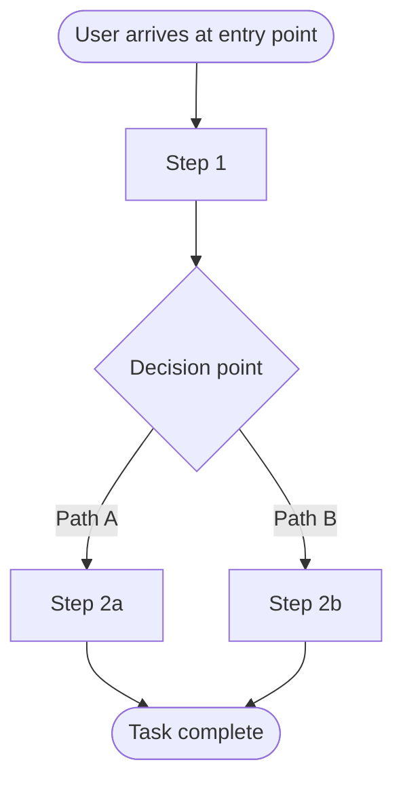

# Design Brainstorm: [Challenge Title]

**Status**: Draft
**Last updated**: [Date]

> **Learning note — Design Brainstorm**
> - **Why**: Exploration phase before committing to a direction — generates multiple distinct approaches so the team makes a deliberate choice, not the first idea
> - **Who uses it**: Designers avoid anchoring on familiar patterns; PMs see range of options before wireframe spec locks in an approach; Engineers flag technical implications early
> - **Key decisions**: Which direction to invest in for the wireframe spec; what design assumptions need user validation
> - **Next step**: Best-bet recommendation → wireframe specification

---

## Discovery

> **Note — Discovery**: Surfaces constraints, user context, and success conditions before generating ideas. Key outcome: after reading discovery answers, can someone generate better-targeted design directions than without it?

*Questions asked to clarify the design challenge:*

1. [Question 1]
2. [Question 2]
3. [Question 3]
4. [Question 4]
5. [Question 5]

*User's answers:*

> [Answers recorded here before brainstorm proceeds]

---

## Design Challenge

> **Note — Design Challenge**: The HMW framing makes the challenge open-ended and solvable. Key calibration: too broad generates unfocused directions; too narrow constrains ideation to a solution. Hard constraints are non-negotiable; soft constraints should be challenged.

**How might we** [restate as HMW question]?

**Primary user**: [Who they are, their goal, and their context — device, environment, emotional state]

**Hard constraints**: [Platform, accessibility requirements, design system, technical limits]

**Soft constraints**: [Brand tone, visual language, team familiarity — can be challenged]

**Design success condition**: [What the experience must achieve for the user to feel it worked]

---

## Concepts

> **Note — Concepts by Direction**: Each direction represents a different fundamental assumption about how users should experience the feature. Key insight: the most familiar direction is easiest to build and validate; the most differentiated is highest-risk but potentially highest-reward.

### [Direction 1 Name]

- [Concept 1] — *example: [real product or pattern that uses this approach]*
- [Concept 2] — *example: [real product or pattern]*
- [Concept 3]

### [Direction 2 Name]

- [Concept 4] — *example: [real product or pattern]*
- [Concept 5]
- [Concept 6]

### [Direction 3 Name]

- [Concept 7] — *example: [real product or pattern]*
- [Concept 8]
- [Concept 9]

### [Direction 4 Name]

- [Concept 10] — *example: [real product or pattern]*
- [Concept 11]
- [Concept 12]

**Most familiar to users**: [Direction name]
**Most differentiated**: [Direction name]
**Easiest to prototype**: [Direction name]

---

## Direction Map

> **Note — Direction Map**: Reveals which directions are compatible (could be combined), which are alternatives, and where genuine tensions exist. Key insight: tensions usually represent a real product decision — optimizing for discoverability vs. efficiency, familiarity vs. differentiation.

---

## Primary Flow

> **Note — Primary Flow**: Maps how users move through the experience in the most promising direction. Key discipline: if the flow has more than 7–8 nodes, the experience is likely too complex — simplify before moving to wireframes.

---

## Evaluation

> **Note — Evaluation**: Where divergent thinking closes and convergent thinking begins. Key discipline: don't let any single dimension dominate. "Testability" is particularly important — a concept that can be validated with a simple prototype in 2 days is often worth exploring over a polished concept that takes 2 weeks to test.

> 💡 **Tip**: *[Your AI will highlight which concept best fits your specific user context and constraints, and flag which design assumption most needs user validation before committing to wireframes.]*

| Concept | Usability | Accessibility | Feasibility | Distinctiveness | Testability | Notes |
| ------- | --------- | ------------- | ----------- | --------------- | ----------- | ----- |
| [Concept A] | H / M / L | H / M / L | H / M / L | H / M / L | H / M / L | [key tradeoff] |
| [Concept B] | H / M / L | H / M / L | H / M / L | H / M / L | H / M / L | [key tradeoff] |
| [Concept C] | H / M / L | H / M / L | H / M / L | H / M / L | H / M / L | [key tradeoff] |
| [Concept D] | H / M / L | H / M / L | H / M / L | H / M / L | H / M / L | [key tradeoff] |
| [Concept E] | H / M / L | H / M / L | H / M / L | H / M / L | H / M / L | [key tradeoff] |

---

## Side-by-Side Experience Description

> **Note — Side-by-Side Experience Description**: Writing the experience in plain language forces implicit assumptions to become explicit. Test: can someone who hasn't seen any mockups accurately predict what they would see and do on screen after reading each description?

### [Top Concept A]
*What it looks and feels like for the user:*
[Plain-language description of the experience — what the user sees, what they do, what happens next. No design jargon.]

### [Top Concept B]
*What it looks and feels like for the user:*
[Plain-language description of the experience.]

### [Top Concept C]
*What it looks and feels like for the user:*
[Plain-language description of the experience.]

---

## Recommendations

> **Note — Recommendations**: Three recommendations serve different risk profiles. Key discipline: the "key design assumption" field names what must be true about users for each direction to work — that becomes the primary hypothesis for usability testing.

### Best bet — [Direction name]
[2–3 sentences on why this is the strongest overall direction]

**Next action**: [Concrete next step]
**Key design assumption**: [What this direction depends on being true about users]
**Biggest usability risk**: [Most likely failure point, and how to de-risk it with a prototype or test]

### Bold move — [Direction name]
[2–3 sentences on why this is worth exploring despite being more unconventional]

**Next action**: [Concrete next step]
**Key design assumption**: [What this direction depends on being true about users]
**Biggest usability risk**: [Most likely failure point, and how to de-risk it]

### Quick prototype — [Direction name]
[2–3 sentences on why this is the fastest to mock up and test with users]

**Next action**: [Concrete next step]
**Key design assumption**: [What this direction depends on being true about users]
**Biggest usability risk**: [Most likely failure point, and how to de-risk it]

---

## Worth Revisiting

> **Note — Worth Revisiting**: Directions not recommended now can become right if context changes. Documenting why and what would change that prevents relitigating brainstorm decisions.

| Direction | Why lower priority now | What would change this |
| --------- | ---------------------- | ---------------------- |
| [Direction X] | [Reason] | [Condition that would unlock it] |
| [Direction Y] | [Reason] | [Condition that would unlock it] |

---

## What's Missing

> **Note — What's Missing**: Naming knowledge gaps prevents over-confidence in the recommendation. If any gap would change the recommended direction, investigate before writing the wireframe spec.

- [Gap 1 — missing user research, unclear requirement, platform constraint, or unexplored angle]
- [Gap 2]
- [Gap 3]
