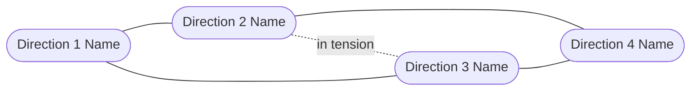

# Design Brainstorm: [Challenge Title]

**Status**: Draft
**Last updated**: [Date]

---

## Discovery

*Questions asked to clarify the design challenge:*

1. [Question 1]
2. [Question 2]
3. [Question 3]
4. [Question 4]
5. [Question 5]

*User's answers:*

> [Answers recorded here before brainstorm proceeds]

---

## Design Challenge

**How might we** [restate as HMW question]?

**Primary user**: [Who they are, their goal, and their context — device, environment, emotional state]

**Hard constraints**: [Platform, accessibility requirements, design system, technical limits]

**Soft constraints**: [Brand tone, visual language, team familiarity — can be challenged]

**Design success condition**: [What the experience must achieve for the user to feel it worked]

---

## Concepts

### [Direction 1 Name]

- [Concept 1] — *example: [real product or pattern that uses this approach]*
- [Concept 2] — *example: [real product or pattern]*
- [Concept 3]

### [Direction 2 Name]

- [Concept 4] — *example: [real product or pattern]*
- [Concept 5]
- [Concept 6]

### [Direction 3 Name]

- [Concept 7] — *example: [real product or pattern]*
- [Concept 8]
- [Concept 9]

### [Direction 4 Name]

- [Concept 10] — *example: [real product or pattern]*
- [Concept 11]
- [Concept 12]

**Most familiar to users**: [Direction name]
**Most differentiated**: [Direction name]
**Easiest to prototype**: [Direction name]

---

## Direction Map

*Replace nodes and labels with actual direction names and relationships.*

---

## Primary Flow

*Replace with the actual user flow for the most promising direction.*

---

## Evaluation

| Concept | Usability | Accessibility | Feasibility | Distinctiveness | Testability | Notes |
| ------- | --------- | ------------- | ----------- | --------------- | ----------- | ----- |
| [Concept A] | H / M / L | H / M / L | H / M / L | H / M / L | H / M / L | [key tradeoff] |
| [Concept B] | H / M / L | H / M / L | H / M / L | H / M / L | H / M / L | [key tradeoff] |
| [Concept C] | H / M / L | H / M / L | H / M / L | H / M / L | H / M / L | [key tradeoff] |
| [Concept D] | H / M / L | H / M / L | H / M / L | H / M / L | H / M / L | [key tradeoff] |
| [Concept E] | H / M / L | H / M / L | H / M / L | H / M / L | H / M / L | [key tradeoff] |

---

## Side-by-Side Experience Description

### [Top Concept A]
*What it looks and feels like for the user:*
[Plain-language description of the experience — what the user sees, what they do, what happens next. No design jargon.]

### [Top Concept B]
*What it looks and feels like for the user:*
[Plain-language description of the experience.]

### [Top Concept C]
*What it looks and feels like for the user:*
[Plain-language description of the experience.]

---

## Recommendations

### Best bet — [Direction name]
[2–3 sentences on why this is the strongest overall direction]

**Next action**: [Concrete next step]
**Key design assumption**: [What this direction depends on being true about users]
**Biggest usability risk**: [Most likely failure point, and how to de-risk it with a prototype or test]

### Bold move — [Direction name]
[2–3 sentences on why this is worth exploring despite being more unconventional]

**Next action**: [Concrete next step]
**Key design assumption**: [What this direction depends on being true about users]
**Biggest usability risk**: [Most likely failure point, and how to de-risk it]

### Quick prototype — [Direction name]
[2–3 sentences on why this is the fastest to mock up and test with users]

**Next action**: [Concrete next step]
**Key design assumption**: [What this direction depends on being true about users]
**Biggest usability risk**: [Most likely failure point, and how to de-risk it]

---

## Worth Revisiting

| Direction | Why lower priority now | What would change this |
| --------- | ---------------------- | ---------------------- |
| [Direction X] | [Reason] | [Condition that would unlock it — e.g. design system component, user research finding] |
| [Direction Y] | [Reason] | [Condition that would unlock it] |

---

## What's Missing

- [Gap 1 — missing user research, unclear requirement, platform constraint, or unexplored angle]
- [Gap 2]
- [Gap 3]
