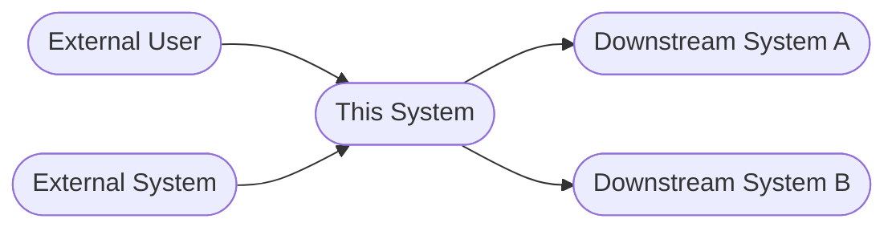

# Architectural Design: [Feature / System Name]

**Author**: [Name]
**Date**: [Date]
**Status**: Draft | In Review | Approved
**Related PRD**: [Link]
**Related Solution Analysis**: [Link]
**Engineering Owner**: [Name]

> **Learning note — Architectural Design**
> - **Why**: Defines the blueprint for system structure — components, responsibilities, communication patterns, and non-functional properties — before writing any code
> - **Who uses it**: Engineers make structural decisions when changes are cheap; Engineering leads evaluate quality attribute coverage; PMs understand delivery dependencies and integration risks
> - **Key decisions**: Which architectural style fits the NFRs and team constraints? How do components communicate and what are the failure modes? ADRs preserve the *why* for future engineers
> - **Next step**: Approved design → tech spec Architecture section; ADRs added to the project's decision log

---

## Non-Functional Requirements (NFRs)

> **Note — Non-Functional Requirements**: NFRs are the foundation of every architectural decision — a system designed for 100 RPS will fail at 10,000 RPS. State them explicitly before making choices so reviewers can evaluate whether the design actually achieves them.

> 💡 **Tip**: *[Your AI will identify which NFRs are most constraining for this specific system and flag where architectural choices may not meet stated targets.]*

*These drive every architectural decision. State them before making choices.*

| NFR | Requirement | Measurement | Priority |
|-----|-------------|-------------|----------|
| **Performance** | p95 latency < [X]ms | [How measured] | Must / Should / Nice |
| **Throughput** | [X] RPS sustained | Load test | Must / Should / Nice |
| **Availability** | [99.9% / 99.99%] uptime | SLO dashboard | Must / Should / Nice |
| **RTO** | Recovery within [X] min | Failover drill | Must / Should / Nice |
| **RPO** | Max [X] min data loss | Backup test | Must / Should / Nice |
| **Scalability** | Support [X]× current load by [date] | Load test | Must / Should / Nice |
| **Security** | [Compliance standard / data classification] | Security review | Must / Should / Nice |
| **Maintainability** | [New engineer productive within X days] | — | Should |
| **Testability** | [Components testable in isolation] | Test suite | Must / Should |

---

## Architectural Style

> **Note — Architectural Style**: The highest-level structural decision — it determines how the system is decomposed and how components communicate. The "styles considered and rejected" table prevents future engineers from proposing a different style without knowing why the current one was chosen.

**Chosen style**: [Monolith / Layered / Microservices / Event-driven / CQRS / Hexagonal / Hybrid]

**Rationale**: [Why this style fits the NFRs and the team's operational capability. Be specific — reference the NFRs above.]

**Styles considered and rejected**:

| Style | Reason rejected |
|-------|----------------|
| | |
| | |

---

## System Context

> **Note — System Context**: Shows where this system sits in the broader landscape — what users interact with it, what external systems it connects to. The trust boundaries annotation is especially important for security review — they define where authentication and authorization must be enforced.

*Where this system or feature sits in the broader landscape.*

**External actors**: [Users, external systems, or services that interact with this system]
**Trust boundaries**: [Where authentication and authorization are enforced]

---

## Component Design

> **Note — Component Design**: The "Does NOT own" column is as important as the "Owns" column — explicit exclusions prevent scope creep at the component level and reduce coordination overhead during implementation.

### Component Overview

| Component | Responsibility | Owns | Does NOT own |
|-----------|---------------|------|-------------|
| | [Single sentence] | [Data / logic it controls] | [Explicit exclusions] |
| | | | |

### Component Details

---

#### [Component Name]

**Responsibility**: [One sentence — what is the single job of this component?]

**Public interface** (contract with other components):
- Exposes: [API endpoints / events / data / files]
- Consumes: [APIs / events / data from other components]

**Internal structure** (if non-trivial):
- [Key sub-modules or layers within this component]

**Data owned**: [Which entities or stores this component is the system of record for]

**Scaling strategy**: [How this component scales — horizontal / vertical / stateless / stateful]

---

*(Repeat for each component)*

---

## Integration Patterns

> **Note — Integration Patterns**: Synchronous dependencies on unreliable services will bring down the caller. The data ownership table is equally important — ambiguous ownership is the most common cause of data inconsistency bugs in multi-component systems.

| Integration | Components | Pattern | Consistency | Failure handling |
|-------------|-----------|---------|-------------|-----------------|
| [A → B] | [From] → [To] | Sync REST / Async event / gRPC / File | Strong / Eventual | Retry + DLQ / Circuit breaker / Fallback |
| | | | | |

### Data Ownership

*Which component is the system of record for each key entity.*

| Entity | Owner | Consumers | Notes |
|--------|-------|-----------|-------|
| | | | |

---

## Cross-Cutting Concerns

> **Note — Cross-Cutting Concerns**: Affect every component rather than one specific area — inconsistent auth enforcement creates security holes; inconsistent logging makes tracing impossible. The most common gap is observability — systems not instrumented during design end up with poor debuggability in production.

### Authentication & Authorization
- **Identity provider**: [Where identities are established]
- **Enforcement point**: [Which component(s) enforce authN and authZ]
- **Authorization model**: [RBAC / ABAC / ACL / policy-based]
- **Service-to-service auth**: [mTLS / JWT / API key / none]

### Error Handling
- **Propagation strategy**: [How errors cross component boundaries — rethrow, wrap, transform]
- **User-facing errors**: [What reaches the user and how it's formatted]
- **Internal errors**: [Logged and surfaced how]

### Caching
| Cache | Layer | What is cached | TTL | Invalidation strategy |
|-------|-------|---------------|-----|----------------------|
| | CDN / App / DB | | | |

### Logging & Observability
- **Correlation**: [How requests are traced across components — trace ID propagation]
- **Log levels**: [What is logged at DEBUG / INFO / WARN / ERROR]
- **Metrics**: [Key metrics exposed per component, SLO-relevant signals]
- **Alerting**: [What conditions trigger alerts and to whom]

### Configuration Management
- **Environment config**: [How env-specific values are injected — env vars, config service, secrets manager]
- **Feature flags**: [How in-progress features are controlled — flag service, config, code]

---

## AI Architecture *(complete if AI/ML components are in scope; delete this section if not)*

> **Note — AI Architecture**: AI components introduce non-determinism, variable latency, cost scaling, and quality degradation patterns not present in traditional software. These decisions are as consequential as database and API design — make them explicitly before building.

### Model Serving Layer

| Decision | Choice | Rationale |
|----------|--------|-----------|
| **AI component type** | LLM generation / classification / embeddings / RAG / recommendations / vision | |
| **Integration approach** | API (managed) / Self-hosted | |
| **Execution model** | Synchronous / Asynchronous / Background | |
| **Caching** | Cached — TTL: [X] / Not cached | |
| **Rate limit handling** | Queue / Degrade gracefully / Error to user | |

### Prompt Pipeline

| Element | Design |
|---------|--------|
| **Prompt storage** | Inline in code / External config / Prompt management service: [tool] |
| **Prompt versioning** | [Strategy — e.g., git-tracked config files, PromptLayer versions] |
| **Context assembly** | [What data is injected, from where, and in what format] |
| **Token budget** | Max context: [X] tokens. Overflow strategy: truncate / summarise / error |
| **RAG retrieval** *(if applicable)* | Chunk size: [X]. Overlap: [X]. Strategy: dense / sparse / hybrid. Reranking: yes / no |

### Evaluation & Quality Monitoring

| Dimension | Approach |
|-----------|---------|
| **Definition of correct output** | [What does good look like — is ground truth available?] |
| **Development eval** | Human eval / LLM-as-judge / Reference-based metrics / Framework: [tool] |
| **Production monitoring** | [Signals indicating degradation — error rate, latency, user feedback, quality score] |
| **Evaluation cadence** | Per-deploy / Continuous / Triggered by signal |

### Fallback & Graceful Degradation

| Failure mode | Fallback behaviour |
|-------------|-------------------|
| AI API unavailable | [Non-AI fallback / Queue for retry / Error message] |
| Output below quality threshold | [Retry / Surface for human review / Fallback to rule-based] |
| Content filter triggered | [Redirect to alternative flow / Error with explanation] |
| Token budget exceeded | [Truncate context / Summarise / Error to user] |

### AI Observability

| Signal | What is logged | Where |
|--------|---------------|-------|
| Per-call | Prompt, completion, model version, latency, token count, cost | [logging service] |
| Errors | AI API errors, content filter blocks, timeouts | [error tracker] |
| Quality | Quality score per call (if eval is automated) | [dashboard] |
| Cost | Per-feature / per-user / per-session cost attribution | [cost dashboard] |

**Monthly cost estimate at medium scale**: [X tokens × Y requests/day × $Z/1k tokens × 30 days = $___]

**Alert thresholds**: Cost > $[X]/day; Error rate > [Y]%; Latency p95 > [Z]ms

---

## Architectural Risks

> **Note — Architectural Risks**: Structural weaknesses that could cause the system to fail its NFRs under real-world conditions — they can't be fixed with a patch. A risk with a documented mitigation is a managed risk; an undocumented risk is a future incident.

> 💡 **Tip**: *[Your AI will assess which architectural risks are most likely to materialize given your chosen style, NFRs, and team size — and recommend where to prioritize mitigation.]*

| Risk | Quality attribute | Likelihood | Impact | Mitigation |
|------|------------------|-----------|--------|------------|
| Single point of failure: [describe] | Availability | H/M/L | H/M/L | |
| Bottleneck: [describe] | Performance / Scalability | H/M/L | H/M/L | |
| Tight coupling: [describe] | Maintainability | H/M/L | H/M/L | |
| Lock-in: [describe] | Evolvability | H/M/L | H/M/L | |

---

## Architecture Decision Records (ADRs)

> **Note — ADRs**: The most durable artifact of the design process — code changes constantly, but the reasoning behind structural decisions needs to survive team turnover. Write one ADR per significant decision: storage technology, communication pattern, auth model, deployment topology.

---

### ADR-001: [Decision title]

**Status**: Proposed | Accepted | Deprecated | Superseded by ADR-[N]

**Context**: [What situation, constraint, or requirement prompted this decision?]

**Decision**: [What was decided?]

**Rationale**: [Why? Reference specific NFRs or constraints.]

**Consequences**:
- Positive: [What this makes easier]
- Negative: [What this makes harder or more expensive]

**Alternatives considered**:
| Alternative | Reason rejected |
|-------------|----------------|
| | |

---

### ADR-002: [Decision title]

**Status**:
**Context**:
**Decision**:
**Rationale**:
**Consequences**:
- Positive:
- Negative:

**Alternatives considered**:
| Alternative | Reason rejected |
|-------------|----------------|
| | |

---

*(Add ADRs for each significant architectural choice)*

---

## Open Questions

> **Note — Open Questions**: Architectural questions affect the system's fundamental structure and are more expensive to change later than tech spec questions. The "impact on architecture" column forces specificity about what changes depending on the answer.

| Question | Impact on architecture | Owner | Due |
|----------|----------------------|-------|-----|
| | | | |
