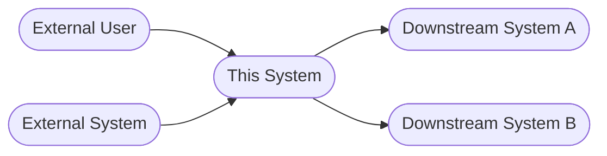
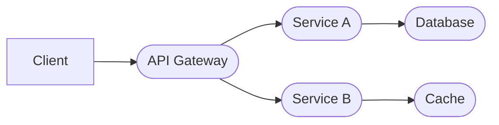

# Technical Specification: [Feature Name]

**Author**: [Name]
**Date**: [Date]
**Status**: Draft | In Review | Approved
**Related PRD**: [Link]
**Related Design Handoff**: [Link]
**Engineering Owner**: [Name]

> **Learning note — Technical Specification**
> - **Why**: Translates *what* needs to be built (PRD) into *how* — making implementation decisions explicit and reviewable before any code is written
> - **Who uses it**: Engineers write it; PM verifies requirements are faithfully translated; Engineering leads review architectural choices and estimate delivery confidence
> - **Key decisions**: Which technical approach is chosen and why? What open questions must resolve before implementation begins?
> - **Next step**: Approved spec → dev plan; open questions tracked to resolution before sprint starts

---

## Overview

> **Note — Overview**: Answers three questions in one paragraph: what is being built, why it matters to the product, and what approach was chosen. If this can't be written clearly in one paragraph, the feature scope needs more alignment before engineering begins.

*One paragraph: what is being built, the product goal, and the approach at a high level.*

---

## Requirements Summary

> **Note — Requirements Summary**: Restating requirements in engineering terms catches PRD ambiguities that weren't visible until implementation was considered. The "clarification needed" column is the most important — unresolved ambiguities are the most common cause of rework.

*Restate the key product requirements in engineering terms. Flag any ambiguities.*

| Requirement | Source (PRD section) | Clarification needed? |
|-------------|---------------------|----------------------|
| | | |
| | | |

**Open ambiguities** (must resolve before implementation):
- 

---

## Solution Options

> **Note — Solution Options**: Evaluating multiple approaches before committing is the highest-leverage activity in the spec — it prevents the "we should have done it differently" conversation six weeks into implementation. The Decision section is the design record that prevents relitigating choices later.

> 💡 **Tip**: *[Your AI will evaluate each option against your specific NFRs, team constraints, and existing stack — and flag which trade-offs matter most for this initiative.]*

*Evaluate 2–4 distinct approaches before committing to one. This section is the design decision record — it prevents relitigating choices later.*

### Evaluation Criteria

| Criterion | Weight | Notes |
|-----------|--------|-------|
| Implementation complexity | | |
| Performance at scale | | |
| Maintainability | | |
| Time to deliver | | |
| Monthly cost (at launch volume) | | Actual dollar estimate — not Low/Medium/High |
| Risk | | |

---

### Option 1: [Name]

**Approach**: [2–3 sentence description of the technical approach]

**Estimated monthly cost**: $[X]/month — [pricing tier assumed, e.g. "Vercel free tier", "Supabase Pro", "pay-as-you-go at ~N req/month"]. Scales to $[Y]/month at 10× usage.

| Criterion | Assessment | Notes |
|-----------|-----------|-------|
| Implementation complexity | Low / Medium / High | |
| Performance at scale | Low / Medium / High | |
| Maintainability | Low / Medium / High | |
| Time to deliver | Low / Medium / High | |
| Monthly cost at launch | $[X] | [Pricing tier] |
| Monthly cost at 10× scale | $[Y] | [What drives the increase] |
| Risk | Low / Medium / High | |

**Pros**:
-
-

**Cons**:
-
-

---

### Option 2: [Name]

**Approach**:

**Estimated monthly cost**: $[X]/month — [pricing tier]. Scales to $[Y]/month at 10× usage.

| Criterion | Assessment | Notes |
|-----------|-----------|-------|
| Implementation complexity | | |
| Performance at scale | | |
| Maintainability | | |
| Time to deliver | | |
| Monthly cost at launch | $[X] | |
| Monthly cost at 10× scale | $[Y] | |
| Risk | | |

**Pros**:
-

**Cons**:
-

---

*(Add Option 3 / Option 4 if needed)*

---

### Decision

> **Note — Decision**: The most referenced section after implementation begins — future engineers look here when asking "why did we build it this way?" Name the specific trade-offs accepted, not just the benefits. The "options ruled out" table prevents re-proposing approaches already evaluated and rejected.

**Recommended option**: [Option N — Name]

**Rationale**: [Why this option best satisfies the requirements and constraints. Be specific about the trade-offs being accepted.]

**Options ruled out**:

| Option | Reason rejected |
|--------|----------------|
| Option [N] | |
| Option [N] | |

---

## Architecture

> **Note — Architecture**: Translates the chosen option into a concrete technical blueprint. The system diagram and data flow surface coupling risks and integration complexity not visible from requirements alone. Link to the full arch-design document if it exists.

*This section is populated from the architectural design. Run `/arch-design` or the `arch-reviewer` agent to produce the full design, then summarise the key outputs here. Link to the full architectural design document if it exists separately.*

**Related architectural design**: [Link to arch-design doc or ADRs]
**Architectural style**: [Monolith / Layered / Microservices / Event-driven / CQRS / Hexagonal / Hybrid]
**Style rationale**: [One sentence — why this style fits the NFRs and team constraints]

### Non-Functional Requirements

| NFR | Requirement | Priority |
|-----|-------------|----------|
| Performance | p95 latency < [X]ms | Must / Should |
| Availability | [99.9% / 99.99%] uptime | Must / Should |
| Scalability | [X]× current load by [date] | Must / Should |
| Security | [Compliance / data classification] | Must / Should |

### System Context

### Component Design

| Component | Responsibility | Owns | Interface |
|-----------|---------------|------|-----------|
| | [Single sentence] | [Data / logic it controls] | [API / events / data] |
| | | | |

### Integration Patterns

| Integration | Pattern | Consistency | Failure handling |
|-------------|---------|-------------|-----------------|
| [A → B] | Sync REST / Async event / gRPC | Strong / Eventual | Retry / Circuit breaker / Fallback |
| | | | |

### Cross-Cutting Concerns

| Concern | Approach |
|---------|---------|
| Authentication & authorization | [Where identity is established and permissions enforced] |
| Error handling | [How errors propagate across boundaries and reach the user] |
| Caching | [Where applied, TTL, invalidation strategy] |
| Logging & tracing | [Correlation mechanism, log levels, key metrics] |
| Feature flags | [How in-progress features are controlled] |

### System Diagram
*Describe or ASCII-draw the components involved and how data flows between them.*

### Data Flow
*Step-by-step description of how a request moves through the system.*

1. 
2. 
3. 

### Architecture Decision Records (ADRs)

*Record each significant architectural choice. Full ADRs live in the architectural design document — summarise here.*

| ADR | Decision | Rationale | Alternatives rejected |
|-----|----------|-----------|----------------------|
| ADR-001 | | | |
| ADR-002 | | | |

---

## Data Model

> **Note — Data Model**: Defines the shape of data and relationships between entities. Ambiguous data ownership between services is one of the most common sources of bugs and inconsistency. Database changes require migration planning — list them separately.

### New / Modified Entities

#### [Entity Name]

| Field | Type | Required | Constraints | Notes |
|-------|------|----------|-------------|-------|
| id | UUID | Yes | Primary key | |
| | | | | |

**Relationships**:
- [Entity] belongs to [Entity] via [foreign key]
- 

### Database Changes

| Change type | Table | Details |
|------------|-------|---------|
| New table | | |
| New column | | |
| New index | | |
| Migration | | |

---

## Key Business Logic

> **Note — Key Business Logic**: Documents non-obvious rules, calculations, and decisions that go beyond simple CRUD. If the logic is complex enough to explain in words, it's complex enough to document here — "it's obvious from the code" is rarely true for future engineers.

*Describe any non-trivial algorithms, rules, or calculations. Skip anything self-evident.*

### [Logic name]

**Rule**: [Description]
**Edge cases**:
- 
- 

---

## APIs

> **Note — APIs**: A high-level index of endpoints produced or consumed. Listing consumed APIs is as important as produced ones — unready internal dependencies block integration and slip timelines. Use `/api-spec` for detailed schemas.

*List endpoints this feature produces or consumes. Use `/api-spec` for detailed schemas.*

| Method | Path | Purpose | Owner |
|--------|------|---------|-------|
| | | | |

---

## Dependencies

> **Note — Dependencies**: The most common source of timeline risk — not because they're hard to build, but because they depend on other teams or services that don't share your priorities.

> 💡 **Tip**: *[Your AI will flag which dependencies carry the highest timeline risk given your current phase and team setup, and identify where cost could surprise you at scale.]*

### Internal Dependencies

| Dependency | Team | Status | Notes |
|-----------|------|--------|-------|
| | | Ready / In Progress / Blocked | |

### External Dependencies

| Dependency | Type | Pricing tier | Est. monthly cost (launch) | Est. monthly cost (10× scale) | Notes |
|-----------|------|-------------|---------------------------|-------------------------------|-------|
| | Third-party API / SDK / Infra | Free / Pro / Pay-as-you-go | $[X] | $[Y] | |

### Cost Summary

| Component | Pricing model | Monthly cost — launch | Monthly cost — 10× scale | Scales with |
|-----------|--------------|----------------------|--------------------------|-------------|
| [e.g. Vercel hosting] | [Free tier / Pro $20/mo] | $[X] | $[Y] | [Traffic / builds / seats] |
| [e.g. Supabase DB] | [Free tier / Pro $25/mo] | $[X] | $[Y] | [Rows / bandwidth] |
| [e.g. Auth provider] | [Free tier / MAU-based] | $[X] | $[Y] | [Monthly active users] |
| **Total** | | **$[X]/month** | **$[Y]/month** | |

> ⚠️ Flag any component where cost scales directly with usage and could surprise the team at growth — e.g. per-API-call pricing, per-MAU auth, or metered database reads.

---

## AI Opportunities

> **Note — AI Opportunities**: Forces a deliberate evaluation of where AI adds value vs. complexity. The Deferred and Rejected tables are as important as Adopted — they prevent relitigating proposals already evaluated. Run the `ai-opportunity-analyst` agent for a structured assessment.

*Populated from the `ai-opportunity-analyst` agent. Run it against this spec and the PRD to identify where AI could add meaningful value — and where simpler approaches are the right call.*

**AI assessment**: [Link to full AI opportunity assessment, or "Not yet run"]

### Adopted AI Opportunities

*Opportunities from the assessment that are incorporated into this spec.*

| Opportunity | AI approach | Incorporated where | Est. monthly cost |
|-------------|------------|-------------------|------------------|
| | | [Architecture section / component] | |

### Deferred AI Opportunities

*Identified but not included in this version — tracked for future consideration.*

| Opportunity | Reason deferred | Revisit when |
|-------------|----------------|-------------|
| | | |

### Rejected AI Opportunities

*Evaluated and ruled out — recorded to prevent relitigating.*

| Opportunity | Why AI is not the right fit |
|-------------|---------------------------|
| | |

---

## Technical Risks

> **Note — Technical Risks**: Surface what could go wrong during implementation before it does. A risk identified and mitigated in the spec is far cheaper than one discovered in production.

| Risk | Likelihood | Impact | Mitigation |
|------|-----------|--------|------------|
| Performance: [describe] | H/M/L | H/M/L | |
| Security: [describe] | H/M/L | H/M/L | |
| Data consistency: [describe] | H/M/L | H/M/L | |
| Third-party reliability: [describe] | H/M/L | H/M/L | |

---

## Complexity Estimate

> **Note — Complexity Estimate**: Include non-obvious work like migrations, error handling, and testing. "Confidence: Low" is important to state explicitly — it signals a spike or more information is needed before committing to a timeline.

| Component | Size | Rationale |
|-----------|------|-----------|
| | S / M / L / XL | |

**Total estimate**: [Range]
**Confidence**: High / Medium / Low — [explain if low]

---

## Open Questions

> **Note — Open Questions**: Every question needs an owner and a due date — a question without an owner won't get answered. Any question still open when implementation starts is a risk to the timeline.

| Question | Owner | Due | Status |
|----------|-------|-----|--------|
| | | | |
