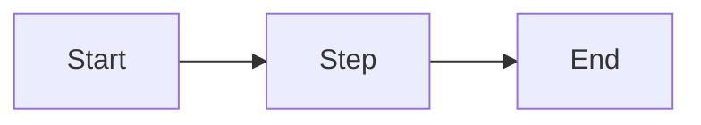

<!-- _class: title -->

# [Presentation Title]

**[Subtitle or tagline]**

[Author] · [Date]

---

# Agenda

1. [Topic 1]
2. [Topic 2]
3. [Topic 3]
4. [Topic 4]
5. [Topic 5]

---

# [Section Heading]

- Key point one
- Key point two
- Key point three

> **Takeaway:** [One-sentence insight]

---

<!-- _class: split -->

# [Two-Column Slide]

**Left column**

- Point A
- Point B
- Point C

**Right column**

- Point D
- Point E
- Point F

---

# [Data / Table Slide]

| Column 1 | Column 2 | Column 3 |
|----------|----------|----------|
| Row 1    | Value    | Value    |
| Row 2    | Value    | Value    |
| Row 3    | Value    | Value    |

---

# [Diagram Slide]

---

# Summary

- Key takeaway 1
- Key takeaway 2
- Key takeaway 3

---

<!-- _class: title -->

# Questions?

[Contact / next steps]
