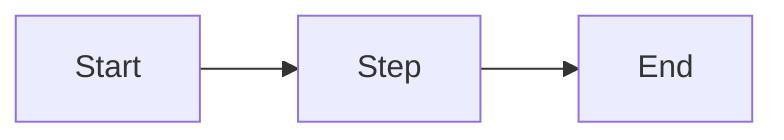

<!-- _class: title -->

# [Presentation Title]

**[Subtitle or tagline]**

[Author] · [Date]

---

# Agenda

> **Note — Agenda**: Signal the decision or action at the end, not just the topics — "By the end of this, you'll decide X" is more useful than a list of section names.

1. [Topic 1]
2. [Topic 2]
3. [Topic 3]
4. [Topic 4]
5. [Topic 5]

---

# [Section Heading]

> **Note — Content Slides**: The slide title should state the conclusion ("Revenue grew 15% driven by Enterprise"), not the topic ("Revenue") — insight titles are more memorable and easier to act on.

- Key point one
- Key point two
- Key point three

> **Takeaway:** [One-sentence insight]

---

<!-- _class: split -->

# [Two-Column Slide]

> **Note — Two-Column Layout**: Best for comparisons (before/after, option A vs. B) or parallel concepts. Keep each column to 3–4 items — if you need more, split into multiple slides.

**Left column**

- Point A
- Point B
- Point C

**Right column**

- Point D
- Point E
- Point F

---

# [Data / Table Slide]

> **Note — Data Slides**: Highlight the most important number or trend — don't present a dense table and expect the audience to find it. More than 5–6 rows or 4 columns is too complex for a slide.

> 💡 **Tip**: *[Your AI will identify which data points are most decision-relevant for this specific audience and recommend how to frame the headline finding.]*

| Column 1 | Column 2 | Column 3 |
|----------|----------|----------|
| Row 1    | Value    | Value    |
| Row 2    | Value    | Value    |
| Row 3    | Value    | Value    |

---

# [Diagram Slide]

> **Note — Diagram Slides**: Use when the relationship between elements is the point, not the elements themselves. A diagram that takes more than 30 seconds to parse at a glance should be simplified or split.

---

# Summary

> **Note — Summary Slide**: Each takeaway should be a complete, standalone insight — not a fragment that requires preceding slides to make sense. This is what the audience remembers and quotes.

- Key takeaway 1
- Key takeaway 2
- Key takeaway 3

---

<!-- _class: title -->

# Questions?

> **Note — Questions Slide**: Prepare for the most likely questions in advance — what alternatives were rejected, what happens if this doesn't work, what scope changes could this require.

[Contact / next steps]
