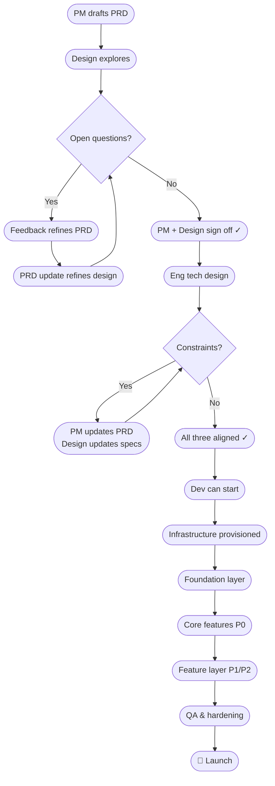

# Release Plan: [Project Name]

**Author**: [Name]
**Date**: [Date]
**Target launch**: [Date]
**Status**: Draft | Active | Shipped
**Methodology**: Sprints | Flow (Kanban)
**Team**: [Names and roles]
**Related PRD**: [Link]

---

## Project Overview

**What we're building**: [One sentence]
**Why now**: [Strategic reason or deadline]
**Success definition**: [How we'll know this shipped successfully — tie to PRD metrics]

---

## Phases & Milestones

| Phase | Milestone | Owner | Target date | Status | Gate criteria |
|-------|-----------|-------|-------------|--------|---------------|
| A. PM + Design alignment | PM + Design signed off | PM + Designer | | Not started | PRD finalized, all screens covered, PM and Designer mutually sign off |
| B. Tech design | All three aligned, handoff accepted | Eng + PM + Designer | | Not started | Constraints resolved, PRD and design updated, Eng accepts handoff |
| 1. Infrastructure | Environment live | | | Not started | Deploy pipeline working, auth + DB accessible |
| 2. Foundation | Core data models + base APIs complete | | | Not started | End-to-end auth flow working, CRUD on core entities |
| 3. Core build | All P0 features complete | | | Not started | P0 acceptance criteria met, no blocking bugs |
| 4. Feature build | P1/P2 features complete | | | Not started | QA sign-off on all P1 items |
| 5. QA & hardening | All tests passing | | | Not started | Test plan complete, zero P0/P1 bugs open |
| 6. Launch | Shipped to production | | | Not started | Smoke tests pass, monitoring live, rollback ready |

---

## Alignment Rounds — Phase A (PM + Design)

*Each round is one pass of the PM → Design → feedback loop. Rounds continue until mutual sign-off.*

| Round | PM changes | Design changes | Open questions | Status |
|-------|-----------|----------------|----------------|--------|
| Round 1 | | | | In progress |
| Round 2 | | | | Pending |

**Sign-off status**: PM — Pending | Designer — Pending

**Phase A complete when**: PM and Designer both sign off with no open questions outstanding.

---

## Tech Design Rounds — Phase B

*Each round is one pass of the Eng review → constraint identification → PM/Design response loop.*

| Round | Constraints identified | PRD updates needed | Design updates needed | Resolution status |
|-------|----------------------|-------------------|----------------------|------------------|
| Round 1 | | | | Pending |

**Sign-off status**: PM — Pending | Designer — Pending | Eng — Pending

**Phase B complete when**: All constraints resolved, all three parties sign off, Eng accepts design handoff.

---

## Dependency Map

*What must be complete before each subsequent phase can start. Note the iterative feedback loops in Phases A and B.*

### Unresolved Dependencies

| Dependency | Blocked work | Owner | Due | Status |
|-----------|-------------|-------|-----|--------|
| | | | | |

---

## Build Sequence

*Work must be completed in layer order. Do not start a layer until the previous layer is stable.*

---

### PM Layer — Discovery & Requirements
*Must be complete before Design can start. PM-led, no Eng or Design resources required.*

- [ ] Problem framing and assumptions documented
- [ ] Competitive landscape assessed
- [ ] PRD drafted — problem, goals, user stories, P0/P1/P2 requirements
- [ ] Success metrics defined
- [ ] Scope boundaries set (in scope / out of scope / deferred)
- [ ] RICE or MoSCoW prioritization complete

**PM Layer complete when**: Initial PRD is ready for Design to start exploring — not finalized, ready for first round.

---

### Design Layer — Exploration & Alignment
*Runs iteratively with PM until mutual sign-off. No Eng resources required.*

**Round structure**: Each round, Design works from the current PRD state → produces or refines screens → surfaces open questions → PM updates PRD → Design updates screens → repeat.

- [ ] UX brief produced (user goals, flows, constraints)
- [ ] Key screens wireframed (all P0 flows covered)
- [ ] Design feedback incorporated into PRD (per round)
- [ ] PRD updates incorporated into design (per round)
- [ ] All P0 screens with acceptance criteria
- [ ] Design review complete — usability, accessibility, edge cases
- [ ] Design handoff doc prepared

**Design Layer complete when**: PM and Designer mutually sign off — PRD is final, all screens are covered, no open questions remain.

---

### Tech Design Layer — Constraint Resolution
*Eng reviews PM + Design outputs and identifies technical constraints. All three roles engaged.*

- [ ] Eng reviews PRD and design handoff
- [ ] Technical constraints identified and documented
- [ ] Architecture or implementation approach proposed
- [ ] Constraint feedback incorporated into PRD (per round)
- [ ] Constraint feedback incorporated into design (per round)
- [ ] Eng accepts final design handoff
- [ ] Tech spec or dev plan drafted (if required by tier)

**Tech Design Layer complete when**: All constraints resolved, all three parties sign off, Eng is unblocked to start dev.

---

### Layer 1 — Infrastructure
*Must be in place before any feature code is written. Specific tech choices — hosting platform, database, auth system, CI/CD tooling — are determined in Phase B. Fill in the bracketed items below only after Phase B is complete.*

- [ ] Hosting environment provisioned — *[TBD in Phase B]*
- [ ] Database provisioned and accessible — *[TBD in Phase B]*
- [ ] Auth system configured — *[TBD in Phase B]*
- [ ] CI/CD pipeline working (commit → test → deploy) — *[TBD in Phase B]*
- [ ] Environment variables and secrets configured
- [ ] Domain and DNS set up (if applicable)
- [ ] Error tracking configured — *[TBD in Phase B]*

**Layer 1 complete when**: A commit to main deploys to production without manual steps.

---

### Layer 2 — Foundation
*Core data models, auth flows, and base APIs. Everything in Layer 3+ is built on top of these.*

- [ ] [Entity 1] — data model + CRUD endpoints
- [ ] [Entity 2] — data model + CRUD endpoints
- [ ] Authentication — sign up, login, session management
- [ ] Authorization — roles and permissions model
- [ ] Base API structure and error handling conventions

**Layer 2 complete when**: A user can sign up, log in, and the core data models are readable and writable end-to-end.

---

### Layer 3 — Core Features (P0)
*Must-haves. Cannot launch without these.*

- [ ] [Feature 1] — [one-line description]
- [ ] [Feature 2] — [one-line description]
- [ ] [Feature 3] — [one-line description]

**Layer 3 complete when**: All P0 acceptance criteria are met and verified.

---

### Layer 4 — Feature Layer (P1/P2)
*Built on top of P0. Can be deferred to v1.1 if timeline is at risk.*

- [ ] [Feature 4] — [one-line description]
- [ ] [Feature 5] — [one-line description]

**Layer 4 complete when**: All P1 acceptance criteria met; P2 items assessed for inclusion or deferral.

---

### Layer 5 — Integration & Polish
*Third-party integrations, edge cases, UX refinements.*

- [ ] [Integration 1] — [service and purpose]
- [ ] Error states and empty states for all flows
- [ ] Loading states and feedback
- [ ] Performance optimisation (if SLO targets are at risk)

**Layer 5 complete when**: All integration acceptance criteria met, no unhandled error states.

---

### Layer 6 — QA & Launch
- [ ] Test plan execution complete
- [ ] All P0/P1 bugs resolved
- [ ] Smoke test checklist passing in production environment
- [ ] Monitoring and alerting live
- [ ] Rollback procedure documented and tested
- [ ] Launch communications prepared

---

## Critical Path

*The sequence where any delay pushes the launch date.*

**Path**: Phase A sign-off → Phase B sign-off → [Layer 1] → [Layer 2] → [Layer 3] → Launch

**Highest current risk on critical path**: [What's most likely to slip and why]

---

## Parallel Workstreams

*Where team members can work simultaneously without blocking each other.*

| Phase / Cycle | [Person 1] | [Person 2] | Sync point |
|--------------|-----------|-----------|------------|
| Phase A (rounds) | PRD refinement | Screen exploration | End of each round |
| Phase B | PRD/design updates | Tech design review | Constraint resolution |
| Layer 1–2 | | | |

---

## Go / No-Go Criteria

| Phase gate | Must be true to proceed |
|-----------|------------------------|
| PM Layer → Design starts | Initial PRD drafted; problem, goals, and P0 requirements clear enough for design to explore |
| Design Layer → Phase A complete | PM and Designer both sign off; PRD finalized; all P0 screens covered with acceptance criteria; no open questions |
| Phase A → Tech Design | PM + Design sign-off confirmed; design handoff doc prepared |
| Tech Design → Dev | All constraints resolved; all three sign off; Eng accepts handoff; tech spec complete (if required) |
| Infrastructure → Foundation | Deploy pipeline working end-to-end; no manual steps to ship |
| Foundation → Core build | Auth works end-to-end; core data models stable (no planned schema changes) |
| Core build → QA | All P0 acceptance criteria met; no P0 bugs open |
| QA → Launch | Test plan complete; zero P0/P1 bugs; rollback plan tested; monitoring live |

---

## Risk Checkpoints

| Checkpoint | When | What to review |
|-----------|------|---------------|
| After PM Layer | Before Design starts | Is the problem well-defined? Is scope realistic? Are key assumptions documented? |
| End of Phase A round 2+ | If iterations are continuing | Are PM and Design converging? Is scope creeping? Set a round limit if needed. |
| Phase A complete | Before Tech Design starts | Is the design handoff doc complete? Are all acceptance criteria written? |
| End of Phase B | Before dev starts | Are all constraints resolved? Is the scope still achievable in the timeline? Any P2 to cut? |
| Mid-build | Halfway through Layer 3 | Is velocity on track? Any features to descope or defer? |
| Pre-QA | Entering Layer 6 | Any unresolved P1 bugs that could block launch? |
| Launch minus 1 week | 7 days before target | Is every item on the launch readiness checklist green? |

---

## Launch Readiness Checklist

**Product**
- [ ] All P0 acceptance criteria met and verified
- [ ] All P1 acceptance criteria met (or deferral documented)
- [ ] No open P0 or P1 bugs
- [ ] Smoke tests passing in production

**Infrastructure**
- [ ] Error tracking live (errors flowing to dashboard)
- [ ] Uptime monitoring configured
- [ ] Alerts set for SLO violations
- [ ] Rollback procedure documented and tested
- [ ] Backups configured (if applicable)

**Communications**
- [ ] Internal team announcement ready
- [ ] Customer-facing announcement ready (if applicable)
- [ ] Support team briefed with FAQ
- [ ] Stakeholders notified of launch date

**Analytics**
- [ ] Success metrics instrumented (from PRD)
- [ ] Baseline measurements captured for comparison

---

## Open Questions

| Question | Owner | Due | Status |
|----------|-------|-----|--------|
| | | | |
