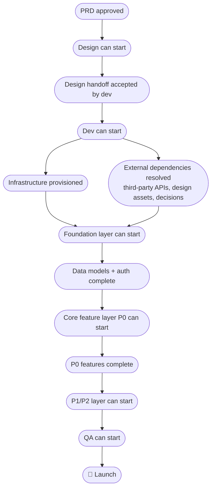

# Release Plan: [Project Name]

**Author**: [Name]
**Date**: [Date]
**Target launch**: [Date]
**Status**: Draft | Active | Shipped
**Methodology**: Sprints | Flow (Kanban)
**Team**: [Names and roles]
**Related PRD**: [Link]

---

## Project Overview

**What we're building**: [One sentence]
**Why now**: [Strategic reason or deadline]
**Success definition**: [How we'll know this shipped successfully — tie to PRD metrics]

---

## Phases & Milestones

| Phase | Milestone | Owner | Target date | Status | Gate criteria |
|-------|-----------|-------|-------------|--------|---------------|
| 1. Discovery | PRD approved | | | Not started | Stakeholder sign-off, key assumptions documented |
| 2. Design | Design handoff complete | | | Not started | Dev team accepts spec, all screens covered |
| 3. Infrastructure | Environment live | | | Not started | Deploy pipeline working, auth + DB accessible |
| 4. Foundation | Core data models + base APIs complete | | | Not started | End-to-end auth flow working, CRUD on core entities |
| 5. Core build | All P0 features complete | | | Not started | P0 acceptance criteria met, no blocking bugs |
| 6. Feature build | P1/P2 features complete | | | Not started | QA sign-off on all P1 items |
| 7. QA & hardening | All tests passing | | | Not started | Test plan complete, zero P0/P1 bugs open |
| 8. Launch | Shipped to production | | | Not started | Smoke tests pass, monitoring live, rollback ready |

---

## Dependency Map

*What must be complete before each subsequent phase can start.*

### Unresolved Dependencies

| Dependency | Blocked work | Owner | Due | Status |
|-----------|-------------|-------|-----|--------|
| | | | | |

---

## Build Sequence

*Work must be built in layer order. Do not start a layer until the previous layer is stable.*

### Layer 1 — Infrastructure
*Must be in place before any feature code is written.*

- [ ] Hosting environment provisioned ([platform])
- [ ] Database provisioned and accessible
- [ ] Auth service configured
- [ ] CI/CD pipeline working (commit → test → deploy)
- [ ] Environment variables and secrets configured
- [ ] Domain and DNS set up (if applicable)
- [ ] Error tracking configured (e.g., Sentry)

**Layer 1 complete when**: A commit to main deploys to production without manual steps.

---

### Layer 2 — Foundation
*Core data models, auth flows, and base APIs. Everything in Layer 3+ is built on top of these.*

- [ ] [Entity 1] — data model + CRUD endpoints
- [ ] [Entity 2] — data model + CRUD endpoints
- [ ] Authentication — sign up, login, session management
- [ ] Authorization — roles and permissions model
- [ ] Base API structure and error handling conventions

**Layer 2 complete when**: A user can sign up, log in, and the core data models are readable and writable end-to-end.

---

### Layer 3 — Core Features (P0)
*Must-haves. Cannot launch without these.*

- [ ] [Feature 1] — [one-line description]
- [ ] [Feature 2] — [one-line description]
- [ ] [Feature 3] — [one-line description]

**Layer 3 complete when**: All P0 acceptance criteria are met and verified.

---

### Layer 4 — Feature Layer (P1/P2)
*Built on top of P0. Can be deferred to v1.1 if timeline is at risk.*

- [ ] [Feature 4] — [one-line description]
- [ ] [Feature 5] — [one-line description]

**Layer 4 complete when**: All P1 acceptance criteria met; P2 items assessed for inclusion or deferral.

---

### Layer 5 — Integration & Polish
*Third-party integrations, edge cases, UX refinements.*

- [ ] [Integration 1] — [service and purpose]
- [ ] Error states and empty states for all flows
- [ ] Loading states and feedback
- [ ] Performance optimisation (if SLO targets are at risk)

**Layer 5 complete when**: All integration acceptance criteria met, no unhandled error states.

---

### Layer 6 — QA & Launch
- [ ] Test plan execution complete
- [ ] All P0/P1 bugs resolved
- [ ] Smoke test checklist passing in production environment
- [ ] Monitoring and alerting live
- [ ] Rollback procedure documented and tested
- [ ] Launch communications prepared

---

## Critical Path

*The sequence where any delay pushes the launch date.*

**Path**: [Task 1] → [Task 2] → [Task 3] → [Task 4] → Launch

**Highest current risk on critical path**: [What's most likely to slip and why]

---

## Parallel Workstreams

*Where two people can work simultaneously without blocking each other.*

| Cycle | [Person 1] | [Person 2] | Sync point |
|-------|-----------|-----------|------------|
| | | | |
| | | | |

---

## Go / No-Go Criteria

| Phase gate | Must be true to proceed |
|-----------|------------------------|
| Discovery → Design | PRD signed off; key assumptions listed and owners assigned |
| Design → Dev | Design handoff accepted; all screens have acceptance criteria |
| Infrastructure → Foundation | Deploy pipeline working end-to-end; no manual steps to ship |
| Foundation → Core build | Auth works end-to-end; core data models stable (no planned schema changes) |
| Core build → QA | All P0 acceptance criteria met; no P0 bugs open |
| QA → Launch | Test plan complete; zero P0/P1 bugs; rollback plan tested; monitoring live |

---

## Risk Checkpoints

| Checkpoint | When | What to review |
|-----------|------|---------------|
| End of discovery | Before design starts | Are assumptions still valid? Is scope realistic for the team size? |
| Design complete | Before dev starts | Is the scope still achievable in the timeline? Any P2 to cut? |
| Mid-build | Halfway through Layer 3 | Is velocity on track? Any features to descope or defer? |
| Pre-QA | Entering Layer 6 | Any unresolved P1 bugs that could block launch? |
| Launch minus 1 week | 7 days before target | Is every item on the launch readiness checklist green? |

---

## Launch Readiness Checklist

**Product**
- [ ] All P0 acceptance criteria met and verified
- [ ] All P1 acceptance criteria met (or deferral documented)
- [ ] No open P0 or P1 bugs
- [ ] Smoke tests passing in production

**Infrastructure**
- [ ] Error tracking live (errors flowing to dashboard)
- [ ] Uptime monitoring configured
- [ ] Alerts set for SLO violations
- [ ] Rollback procedure documented and tested
- [ ] Backups configured (if applicable)

**Communications**
- [ ] Internal team announcement ready
- [ ] Customer-facing announcement ready (if applicable)
- [ ] Support team briefed with FAQ
- [ ] Stakeholders notified of launch date

**Analytics**
- [ ] Success metrics instrumented (from PRD)
- [ ] Baseline measurements captured for comparison

---

## Open Questions

| Question | Owner | Due | Status |
|----------|-------|-----|--------|
| | | | |
