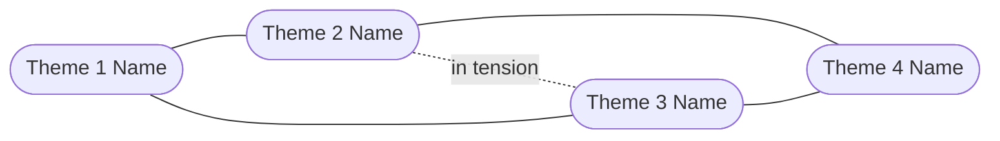

# Brainstorm: [Challenge Title]

**Status**: Draft
**Last updated**: [Date]

---

## Discovery

*Questions asked to clarify the challenge:*

1. [Question 1]
2. [Question 2]
3. [Question 3]
4. [Question 4]
5. [Question 5]

*User's answers:*

> [Answers recorded here before brainstorm proceeds]

---

## Challenge Statement

**How might we** [restate as HMW question]?

**Primary user**: [Who they are and what they're trying to achieve]

**Hard constraints**: [Non-negotiables the ideas must respect]

**Soft constraints**: [Preferences to consider but that can be challenged]

**Success condition**: [What a winning idea needs to achieve — metric, outcome, or user behaviour]

---

## Ideas

### [Theme 1 Name]

- [Idea 1] — *example: [real product or pattern that demonstrates this approach]*
- [Idea 2] — *example: [real product or pattern]*
- [Idea 3]

### [Theme 2 Name]

- [Idea 4] — *example: [real product or pattern]*
- [Idea 5]
- [Idea 6]

### [Theme 3 Name]

- [Idea 7] — *example: [real product or pattern]*
- [Idea 8]
- [Idea 9]

### [Theme 4 Name]

- [Idea 10] — *example: [real product or pattern]*
- [Idea 11]
- [Idea 12]

**Most conventional cluster**: [Theme name]
**Most novel cluster**: [Theme name]
**Broadest range**: [Theme name]

---

## Concept Map

*Replace nodes and labels with actual theme names and relationships.*

---

## Evaluation

| Idea | User impact | Feasibility | Novelty | Speed to validate | Notes |
| ---- | ----------- | ----------- | ------- | ----------------- | ----- |
| [Idea A] | H / M / L | H / M / L | H / M / L | H / M / L | [key tradeoff] |
| [Idea B] | H / M / L | H / M / L | H / M / L | H / M / L | [key tradeoff] |
| [Idea C] | H / M / L | H / M / L | H / M / L | H / M / L | [key tradeoff] |
| [Idea D] | H / M / L | H / M / L | H / M / L | H / M / L | [key tradeoff] |
| [Idea E] | H / M / L | H / M / L | H / M / L | H / M / L | [key tradeoff] |

---

## Decision Tree

*Replace with actual ideas and decision criteria.*

---

## Recommendations

### Best bet — [Idea name]
[2–3 sentences on why this is the strongest overall option]

**Next action**: [Concrete next step]
**Key assumption**: [What this idea depends on being true]
**Biggest risk**: [Most likely reason this fails, and how to de-risk it]

### Bold move — [Idea name]
[2–3 sentences on why this is worth exploring despite higher risk or novelty]

**Next action**: [Concrete next step]
**Key assumption**: [What this idea depends on being true]
**Biggest risk**: [Most likely reason this fails, and how to de-risk it]

### Quick win — [Idea name]
[2–3 sentences on why this is the fastest to validate]

**Next action**: [Concrete next step]
**Key assumption**: [What this idea depends on being true]
**Biggest risk**: [Most likely reason this fails, and how to de-risk it]

---

## Worth Revisiting

| Idea | Why lower priority now | What would change this |
| ---- | ---------------------- | ---------------------- |
| [Idea X] | [Reason] | [Condition that would unlock it] |
| [Idea Y] | [Reason] | [Condition that would unlock it] |

---

## What's Missing

- [Gap 1 — data, research, stakeholder perspective, or unexplored angle]
- [Gap 2]
- [Gap 3]
