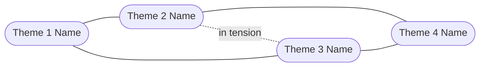
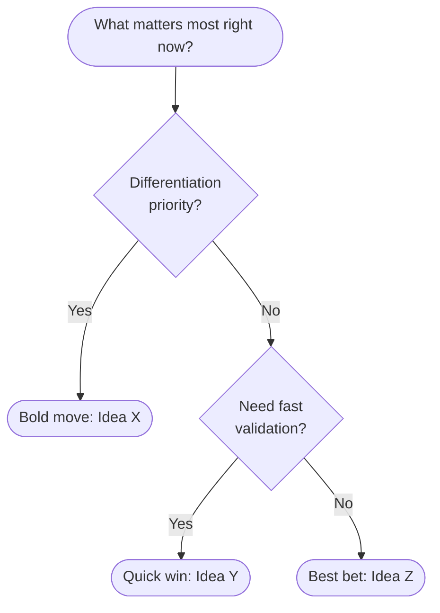

# Brainstorm: [Challenge Title]

**Status**: Draft
**Last updated**: [Date]

> **Learning note — PM Brainstorm**
> - **Why**: Generates many options before evaluating any — avoids anchoring on the first idea that comes to mind
> - **Who uses it**: PM to avoid premature convergence; team to surface approaches that wouldn't emerge linearly
> - **Key decisions**: Which idea cluster to invest in; what assumptions to test before committing
> - **Next step**: Best-bet recommendation feeds into a brief or PRD

---

## Discovery

> **Note — Discovery**: Clarifying questions surface assumptions, constraints, and success conditions that should inform every idea. Key outcome: after reading the discovery answers, can someone generate better-targeted ideas than without it?

*Questions asked to clarify the challenge:*

1. [Question 1]
2. [Question 2]
3. [Question 3]
4. [Question 4]
5. [Question 5]

*User's answers:*

> [Answers recorded here before brainstorm proceeds]

---

## Challenge Statement

> **Note — Challenge Statement**: The HMW format frames the challenge as open-ended and solvable. Key discipline: specific enough to generate focused ideas, but broad enough to leave room for novel approaches.

**How might we** [restate as HMW question]?

**Primary user**: [Who they are and what they're trying to achieve]

**Hard constraints**: [Non-negotiables the ideas must respect]

**Soft constraints**: [Preferences to consider but that can be challenged]

**Success condition**: [What a winning idea needs to achieve — metric, outcome, or user behaviour]

---

## Ideas

> **Note — Ideas by Theme**: Grouping reveals patterns — clusters of similar approaches and tensions between them. Key insight: the most conventional cluster has the clearest path; the most novel cluster often has the most upside and most risk.

### [Theme 1 Name]

- [Idea 1] — *example: [real product or pattern that demonstrates this approach]*
- [Idea 2] — *example: [real product or pattern]*
- [Idea 3]

### [Theme 2 Name]

- [Idea 4] — *example: [real product or pattern]*
- [Idea 5]
- [Idea 6]

### [Theme 3 Name]

- [Idea 7] — *example: [real product or pattern]*
- [Idea 8]
- [Idea 9]

### [Theme 4 Name]

- [Idea 10] — *example: [real product or pattern]*
- [Idea 11]
- [Idea 12]

**Most conventional cluster**: [Theme name]
**Most novel cluster**: [Theme name]
**Broadest range**: [Theme name]

---

## Concept Map

> **Note — Concept Map**: Shows which directions are complementary, which are alternatives, and where genuine tensions exist. Key insight: are tensions a sign of a genuinely hard trade-off, or a false dilemma?

---

## Evaluation

> **Note — Evaluation**: The convergent phase — makes trade-offs explicit rather than implicit. Key question: are there ideas that score high enough on "speed to validate" to run a quick test before committing?

> 💡 **Tip**: *[Your AI will highlight which ideas best fit your specific constraints — timeline, team size, technical feasibility — and which assumptions most need testing before committing.]*

| Idea | User impact | Feasibility | Novelty | Speed to validate | Notes |
| ---- | ----------- | ----------- | ------- | ----------------- | ----- |
| [Idea A] | H / M / L | H / M / L | H / M / L | H / M / L | [key tradeoff] |
| [Idea B] | H / M / L | H / M / L | H / M / L | H / M / L | [key tradeoff] |
| [Idea C] | H / M / L | H / M / L | H / M / L | H / M / L | [key tradeoff] |
| [Idea D] | H / M / L | H / M / L | H / M / L | H / M / L | [key tradeoff] |
| [Idea E] | H / M / L | H / M / L | H / M / L | H / M / L | [key tradeoff] |

---

## Decision Tree

> **Note — Decision Tree**: Makes the implicit selection logic into an explicit, visual argument. If someone wants to change the recommendation, they must change the decision criteria — and this tree makes that discussion concrete.

---

## Recommendations

> **Note — Recommendations**: Three recommendations serve different risk profiles. Key discipline: name the "key assumption" for each — that becomes the primary hypothesis to test before committing.

### Best bet — [Idea name]
[2–3 sentences on why this is the strongest overall option]

**Next action**: [Concrete next step]
**Key assumption**: [What this idea depends on being true]
**Biggest risk**: [Most likely reason this fails, and how to de-risk it]

### Bold move — [Idea name]
[2–3 sentences on why this is worth exploring despite higher risk or novelty]

**Next action**: [Concrete next step]
**Key assumption**: [What this idea depends on being true]
**Biggest risk**: [Most likely reason this fails, and how to de-risk it]

### Quick win — [Idea name]
[2–3 sentences on why this is the fastest to validate]

**Next action**: [Concrete next step]
**Key assumption**: [What this idea depends on being true]
**Biggest risk**: [Most likely reason this fails, and how to de-risk it]

---

## Worth Revisiting

> **Note — Worth Revisiting**: Documents why an idea is lower priority and what would change that — prevents relitigating brainstorm decisions every quarter.

| Idea | Why lower priority now | What would change this |
| ---- | ---------------------- | ---------------------- |
| [Idea X] | [Reason] | [Condition that would unlock it] |
| [Idea Y] | [Reason] | [Condition that would unlock it] |

---

## What's Missing

> **Note — What's Missing**: Naming gaps is intellectual honesty — prevents over-confidence. These gaps are the input to the next discovery sprint. If any gap would change the recommendation, investigate before writing the brief.

- [Gap 1 — data, research, stakeholder perspective, or unexplored angle]
- [Gap 2]
- [Gap 3]
