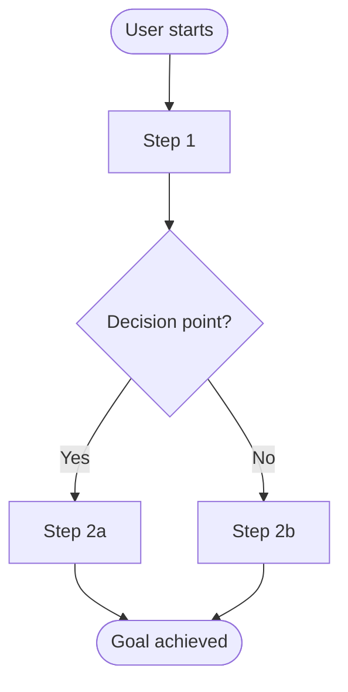

# PRD: [Feature / Product Name]

**Status**: Draft | In Review | Approved  
**Author**: [Name]  
**Last Updated**: [Date]  
**Review By**: [Date]

> **Learning note — Product Requirements Document**
> - **Why**: The primary alignment artifact — defines *what* and *why* before engineering or design invests time
> - **Who uses it**: PM writes it; Engineers and Designers read it for scope; Stakeholders evaluate ROI
> - **Key decisions**: What problem is being solved, who it affects, what success looks like, what's out of scope
> - **Next step**: Once approved, feed into UX brief (design) and tech spec (engineering)

---

## TL;DR

> **Note — TL;DR**: One-paragraph orientation for readers who won't read every section first. If a reader can't summarize the feature from this paragraph alone, the document needs more clarity at the top.

> 💡 **Tip**: *[Your AI will highlight the most critical framing for your specific initiative here — e.g., what assumption most needs validating, or which stakeholder concern most needs addressing.]*

> One paragraph. What is this? Why now? What's the expected outcome?

---

## Problem Statement

> **Note — Problem Statement**: The most important section. Without a clearly articulated problem, solutions can't be evaluated. Key question: is this problem real, significant, and ours to solve?

### User Problem
*What pain point or unmet need does this address? Quote user research or data where possible.*

### Business Problem
*Why does this matter to the company? What metric or goal does it support?*

---

## Goals & Success Metrics

> **Note — Goals & Success Metrics**: Defines how the team will know if the feature worked. Without this, any result can be rationalized as success. Next step: confirm metrics are instrumented before launch, not after.

> 💡 **Tip**: *[Your AI will identify which metric is most critical to track for your specific initiative and whether your targets are realistic given your baseline.]*

| Goal | Metric | Baseline | Target | Timeframe |
|------|--------|----------|--------|-----------|
| | | | | |

**Leading Indicators** (early signals it's working):
- 

**Lagging Indicators** (long-term outcomes):
- 

---

## Target Users

> **Note — Target Users**: Features built for "everyone" are optimized for no one. Key decision: who is the *primary* user, and what trade-offs serve them even at the cost of secondary users?

**Primary Persona**: [Name / Description]  
*Characteristics, needs, context*

**Secondary Persona** (if any): [Name / Description]

---

## Solution Overview

> **Note — Solution Overview**: Bridges problem and implementation — describes *what* will be built without dictating *how*. Key discipline: is this the simplest solution that solves the validated problem?

### Proposed Approach
*High-level description of the solution. What will users be able to do?*

### User Journey / Flow
*Step-by-step walkthrough of the primary experience.*

---

## Requirements

> **Note — Requirements**: The contract between Product and Engineering. Key decision: what is truly P0 (launch-blocking)? If everything is P0, nothing is.

> 💡 **Tip**: *[Your AI will flag any P0 requirements that seem underspecified or risky given your initiative's constraints.]*

### Must Have (P0)
- 

### Should Have (P1)
- 

### Nice to Have (P2)
- 

---

## Out of Scope

> **Note — Out of Scope**: As important as requirements — prevents scope expansion after alignment is reached. Be explicit enough that a new team member would know not to build these items.

- 
- 

---

## Design & Technical Considerations

> **Note — Design & Technical Considerations**: Surfaces known constraints early. Key question: does any constraint here change the requirements or timeline?

### Design Notes
*Key UX decisions, accessibility needs, design constraints.*

### Technical Notes
*Known constraints, dependencies, integration points, performance requirements.*

---

## Risks & Mitigations

> **Note — Risks & Mitigations**: Proactive risk surfacing. Each mitigation needs an owner and a timeline — a risk without a plan is just a worry.

| Risk | Likelihood | Impact | Mitigation |
|------|------------|--------|------------|
| | | | |

---

## Dependencies

> **Note — Dependencies**: Where timelines break down. Key question: are any dependencies on the critical path, and what's the plan if they slip?

| Dependency | Type | Owner | Status |
|-----------|------|-------|--------|
| | Team / System / Timeline | | Confirmed / TBC |

---

## Launch Plan

> **Note — Launch Plan**: A feature isn't shipped until users can successfully use it. Key decisions: what rollout strategy reduces risk, and are all user-facing teams ready?

**Rollout Strategy**: [Phased / Full launch / A-B test / Feature flag]  
**Target Launch Date**: [Date]  

**Launch Checklist**:
- [ ] Engineering complete
- [ ] QA sign-off
- [ ] Documentation updated
- [ ] Support team briefed
- [ ] Analytics instrumented
- [ ] Rollback plan defined

---

## Open Questions

> **Note — Open Questions**: Unresolved decisions that could affect scope or delivery. Every question needs an owner and due date — before engineering handoff, all P0 questions should be resolved.

| Question | Owner | Due Date | Status |
|----------|-------|----------|--------|
| | | | |

---

## Appendix
*Links to research, designs, data, related docs.*
