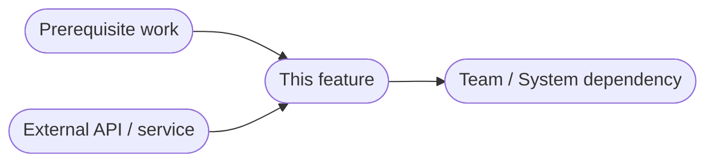

# PRD: [Feature / Product Name]

**Status**: Draft | In Review | Approved  
**Author**: [Name]  
**Last Updated**: [Date]  
**Review By**: [Date]

---

## TL;DR
> One paragraph. What is this? Why now? What's the expected outcome?

---

## Problem Statement

### User Problem
*What pain point or unmet need does this address? Quote user research or data where possible.*

### Business Problem
*Why does this matter to the company? What metric or goal does it support?*

---

## Goals & Success Metrics

| Goal | Metric | Baseline | Target | Timeframe |
|------|--------|----------|--------|-----------|
| | | | | |

**Leading Indicators** (early signals it's working):
- 

**Lagging Indicators** (long-term outcomes):
- 

---

## Target Users

**Primary Persona**: [Name / Description]  
*Characteristics, needs, context*

**Secondary Persona** (if any): [Name / Description]

---

## Solution Overview

### Proposed Approach
*High-level description of the solution. What will users be able to do?*

### User Journey / Flow
*Step-by-step walkthrough of the primary experience. Use a flowchart for linear or branching flows; use a sequenceDiagram if the interaction between user and system needs to be explicit.*

*Replace the diagram above with the actual user journey for this feature. Add or remove steps and branches as needed. For simpler linear flows, remove the decision node.*

---

## Requirements

### Must Have (P0)
- 

### Should Have (P1)
- 

### Nice to Have (P2)
- 

---

## Out of Scope
*Be explicit about what this does NOT include. This is as important as what it does.*

- 
- 

---

## Design & Technical Considerations

### Design Notes
*Key UX decisions, accessibility needs, design constraints.*

### Technical Notes
*Known constraints, dependencies, integration points, performance requirements.*

---

## Risks & Mitigations

| Risk | Likelihood | Impact | Mitigation |
|------|------------|--------|------------|
| | | | |

---

## Dependencies

*Replace with actual dependencies. Arrows point in the direction of dependency — prerequisites point toward this feature, this feature points toward things that depend on it downstream.*

| Dependency | Type | Owner | Status |
|-----------|------|-------|--------|
| | Team / System / Timeline | | Confirmed / TBC |

---

## Launch Plan

**Rollout Strategy**: [Phased / Full launch / A-B test / Feature flag]  
**Target Launch Date**: [Date]  

**Launch Checklist**:
- [ ] Engineering complete
- [ ] QA sign-off
- [ ] Documentation updated
- [ ] Support team briefed
- [ ] Analytics instrumented
- [ ] Rollback plan defined

---

## Open Questions

| Question | Owner | Due Date | Status |
|----------|-------|----------|--------|
| | | | |

---

## Appendix
*Links to research, designs, data, related docs.*
